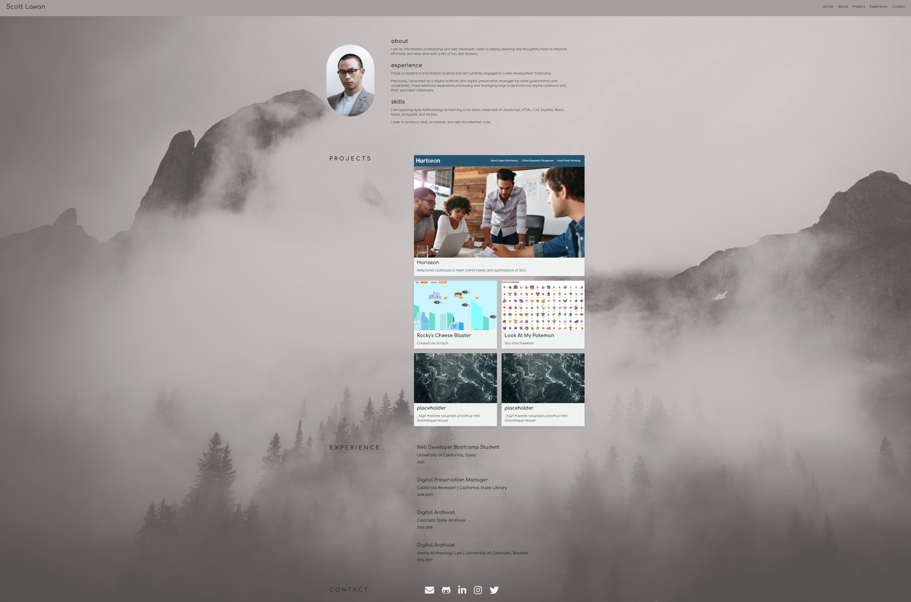

# Scott Lawan Professional Portfolio

## Description

- This is a professional portfolio webpage for the web developer Scott Lawan

### The User Story for this project is as follows:
- An employer would like to view a potential employee's deployed portfolio of work samples so that they can review samples of their work and assess whether they're a good candidate for an open position

### The codebase meets the following critera for acceptance:

- The developer's name, a recent photo, and links to sections about them, their work, and how to contact them are available
- Clicked links in the navigation scroll to the corresponding section of the page
- Clicked links in the section about the developer's work scrolls to the section with titled images of the developer's applications
- When presented with the developer's first application, that application's image should be larger in size than the others
- Clicked images of the developer's applications take the employer to the deployed application
- When resizing the page or viewing the site on various screens and devices, the employer is presented with a responsive layout that adapts to their viewport

### Installation
- The project is uploaded to [GitHub](https://github.com/) at the following repository: [here](https://github.com/sourslaw/02_Professional_Portfolio)
- Deployed application may be seen: [here](https://sourslaw.github.io/02_Professional_Portfolio/)

### Credits
- The project was built using [bulma](https://bulma.io/)

### License
- Copyright (c) Scott Lawan. All rights reserved.
- Licensed under the [MIT](https://opensource.org/licenses/mit-license.php) license.